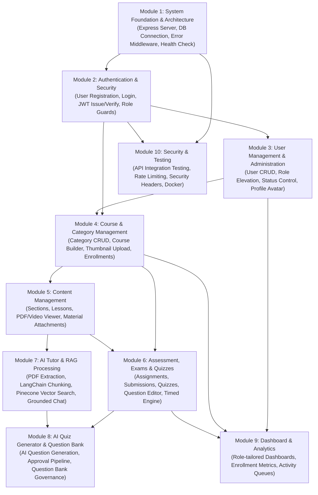

# Module Dependency Map - AI-Powered Learning Management System (AI-LMS)

## 1. System Module Dependency Flow

The diagram below illustrates the actual architectural dependency sequence established across the AI-LMS codebase. Higher-level modules rely directly on the entities, data structures, and access controls built by foundational modules.

---

## 2. Dependency Matrix & Description

| Target Module | Direct Dependencies | Dependency Rationale |
| :--- | :--- | :--- |
| **Module 1 – Foundation** | None | Core prerequisite establishing Express app, Mongoose connection, and error handling middleware. |
| **Module 2 – Auth & Security** | Module 1 | Requires Express server and Mongoose DB connection to register users and verify JWT signatures. |
| **Module 3 – User Management** | Module 2 | Depends on `protect` auth middleware and `authorizeRoles('Admin')` middleware for administrative control. |
| **Module 4 – Course & Category** | Module 2, Module 3 | Courses require assigned `instructor` (User ID) and `category` (Category ID). Access guarded by roles. |
| **Module 5 – Content Management** | Module 4 | Sections, Lessons, and Learning Materials reference a parent `Course` ID. |
| **Module 6 – Assessment & Quizzes**| Module 4, Module 5 | Assignments and Quizzes belong to a specific `Course`. Questions can optionally link to specific `Lessons`. |
| **Module 7 – AI Tutor & RAG** | Module 5 | RAG document processor extracts text from uploaded `LearningMaterial` files belonging to `Lessons`. Vector search filters by `courseId`. |
| **Module 8 – AI Quiz & Bank** | Module 6, Module 7 | AI Quiz Generator synthesizes questions from `Course`/`Lesson`/`Material` contexts. Generated items save into the global `Question` Bank used by Quizzes. |
| **Module 9 – Dashboard** | Module 3..6 | Aggregates user counts, course enrollments, submission grading queues, and quiz performance metrics. |
| **Module 10 – Testing & Security** | All Modules | Integration testing and rate limiting validate the entire API pipeline. |

---

## 3. Execution Dependency Sequence for Future Development

When extending or adding features, implementation must respect the following execution order:

1. **Database Schema Update** (If modifying Mongoose models in `server/models/`)
2. **Validator Schema Creation** (In `server/validators/`)
3. **Service Logic Implementation** (In `server/services/`)
4. **Controller Action Definition** (In `server/controllers/`)
5. **Express Route Registration** (In `server/routes/`)
6. **Frontend Service Method Addition** (In `client/src/services/`)
7. **Frontend Component & Page Integration** (In `client/src/components/` and `client/src/pages/`)
