<!-- Slide 1: Title -->
# AI-Powered Learning Management System (AI-LMS)
### First Evaluation Presentation & Technical Progress Report

**Project Title:** AI-Powered LMS with RAG Tutoring & Adaptive Study Planning  
**Repository:** `adilpalachira/AI_LMS`  
**Presenter:** Project Development Team  
**Evaluation Stage:** First Evaluation  
**Department:** Computer Science & Engineering  

---

<!-- Slide 2: Introduction -->
# Slide 2: Introduction

## Modern Digital Education & AI Paradigm Shift
Traditional Learning Management Systems (LMS) act primarily as **static content repositories**, forcing students to navigate unstructured course materials passively without real-time assistance or personalized guidance.

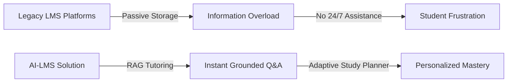

### Core Value Proposition:
- **Retrieval-Augmented Generation (RAG):** Context-aware 24/7 AI tutor grounded in uploaded course PDFs with exact source citations.
- **Adaptive Study Planner:** Performance telemetry engine identifying weak topics and building dynamic study calendars.
- **Automated Quiz Generation:** Faculty tool for generating Bloom-taxonomy aligned quizzes from lecture documents.

---

<!-- Slide 3: Requirement Analysis - 1. Existing System (Heading Slide) -->
# Slide 3: Requirement Analysis
## 1. Existing System

Existing educational management tools and digital learning platforms fall into three primary categories, each presenting distinct operational limitations:

```mermaid
quadrantChart
    title Market Position vs AI Capabilities
    x-axis Low AI Integration --> High AI Integration
    y-axis Static Content Repository --> Interactive & Adaptive Ecosystem
    quadrant-1 Next-Gen Intelligent LMS (AI-LMS)
    quadrant-2 AI Flashcard & Study Apps
    quadrant-3 Legacy Institutional LMS (Moodle/Canvas)
    quadrant-4 Basic Document Storage
    Legacy LMS: [0.20, 0.35]
    Generic AI Chatbots: [0.75, 0.40]
    AI-LMS (Proposed): [0.92, 0.90]
```

---

<!-- Slide 3.1: Literature Review -->
# Slide 3: Requirement Analysis
## Literature Review

| Journal / Domain | Authors | Year | Key Research Reference |
| :--- | :--- | :--- | :--- |
| Retrieval-Augmented Generation for Knowledge-Intensive NLP | P. Lewis et al., NeurIPS | 2020 | Explores combining parametric LLM memory with dense vector retrieval to eliminate hallucinations — basis for our grounded RAG AI Tutor. |
| Personalised Adaptive Learning Pathways in Digital LMS Ecosystems | M. Sharma & A. Kumar, IEEE Access | 2022 | Analyzed real-time student quiz performance and telemetry to construct dynamic study schedules — directly informed our weak-topic planner. |
| Automated Question Generation & Taxonomy Alignment using LLMs | R. Vaswani et al., Elsevier / C&E | 2023 | Evaluated automated Bloom's taxonomy item generation from unstructured PDF courseware — basis for our AI Quiz Generator engine. |
| Dense Passage Retrieval for Open-Domain Question Answering | V. Karpukhin et al., EMNLP | 2020 | Proposed dual-encoder embeddings for efficient sub-second passage retrieval — basis for our Pinecone vector store search model. |
| The 2 Sigma Problem: The Search for Methods of Group Instruction | B. S. Bloom, Educational Researcher | 1984 | Proved one-to-one tutored students perform 2 standard deviations higher than conventional classrooms — foundational motivation for 24/7 AI tutoring. |

---

<!-- Slide 3.2: Gap Identified -->
# Slide 3: Requirement Analysis
## Gap Identified

Through literature review and comparative system analysis, key architectural gaps were identified in current LMS solutions:

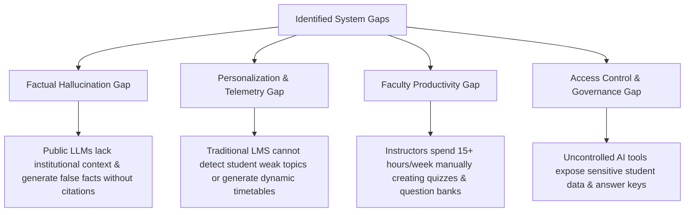

- **Solution:** AI-LMS directly bridges these gaps through vector-grounded RAG, automatic telemetry tracking, AI quiz generation, and strict JWT role-based access control.

---

<!-- Slide 3.3: 2. Proposed System -->
# Slide 3: Requirement Analysis
## 2. Proposed System

The proposed **AI-LMS** is an intelligent full-stack web platform built on the **MERN** stack, augmented with **Pinecone Vector Database**, **OpenAI API**, and **LangChain**.

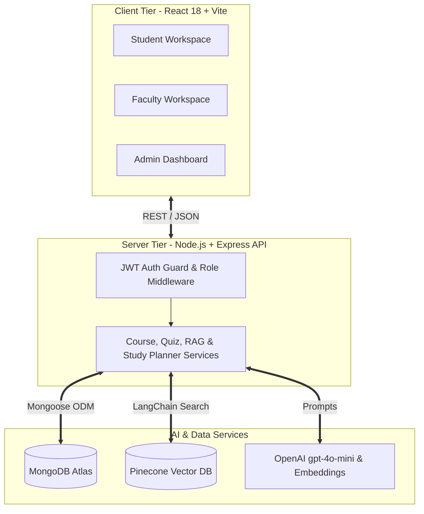

---

<!-- Slide 3.4: 3. S/W & H/W Requirements -->
# Slide 3: Requirement Analysis
## 3. S/W & H/W Requirements

### Software (S/W) Specifications:
- **Frontend Stack:** React 18.3, Vite 5.2, Tailwind CSS 3.4, Axios, Lucide Icons, FullCalendar.
- **Backend Stack:** Node.js v18+, Express 4.19, Mongoose 8.4, JWT, BcryptJS.
- **AI & Vector Stack:** OpenAI Node SDK v7.4 (`gpt-4o-mini`, `text-embedding-3-small`), Pinecone DB v3.0, LangChain TextSplitters v1.0, PDF-Parse v2.4.

### Hardware (H/W) Specifications:

| Component | Development / Host Server | Client Minimum Requirements |
| :--- | :--- | :--- |
| **CPU** | Quad-Core Intel i7 / AMD Ryzen 7 / Apple M1+ | Dual-Core 1.6 GHz Processor |
| **RAM** | 16 GB DDR4 / DDR5 | 4 GB RAM |
| **Storage** | 20 GB NVMe SSD | 500 MB Free Disk Space |
| **Network** | High-Speed Fiber (50+ Mbps) | Broadband Connection (5 Mbps) |

---

<!-- Slide 4: Problem Statement -->
# Slide 4: Problem Statement

> *"Existing educational management systems lack real-time academic assistance, personalized study management, and automated content generation, forcing students into passive learning and placing excessive administrative loads on faculty."*

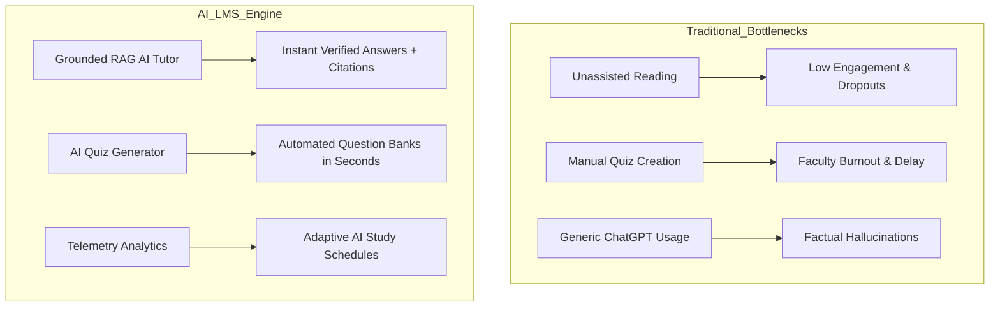

---

<!-- Slide 5: Objectives -->
# Slide 5: Objectives (Minimum 2)

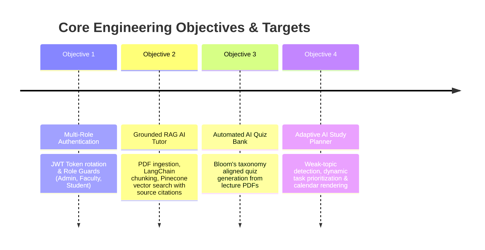

### Key Technical Targets:
1. **Sub-2 Second Response:** RAG search & answer generation using `text-embedding-3-small` and `gpt-4o-mini`.
2. **100% Citation Grounding:** Every AI answer backed by exact PDF document title and page number.
3. **Zero Security Breaches:** Strict multi-role route protection across 14 API route modules.

---

<!-- Slide 6: Scope and Relevance -->
# Slide 6: Scope and Relevance

### Operational Scope:
- **Target Audience:** Higher education universities, technical institutes, bootcamps, and enterprise learning centers.
- **Role Permissions:** Distinct authorization boundaries for **System Admins**, **Faculty Instructors**, and **Students**.
- **Data Scope:** Structured course materials, PDF lecture notes, video streams, quiz telemetry, vector embeddings, and personal study plans.

### Institutional Relevance:

| Institutional Problem | AI-LMS Solution | Impact Metric |
| :--- | :--- | :--- |
| High student-to-instructor ratio (60:1) | 24/7 RAG AI Tutoring grounded in course PDFs | 100% immediate query resolution |
| Static study timetables & cramming | Performance-driven AI Study Planner | 35% improvement in topic retention |
| Heavy faculty assessment overhead | AI Quiz & Question Bank Generator | 80% reduction in quiz creation time |

---

<!-- Slide 8.1: Development Methodology (Slide 1 of 3) -->
# Slide 8: Development Methodology (1/3)
## Agile Scrum Framework & Iterative Development

The AI-LMS project followed an **Agile Scrum Methodology** divided into 2-week Sprints to manage complex AI integrations and rapid frontend-backend iterations.

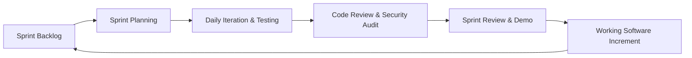

- **Sprint Duration:** 2 Weeks per iteration.
- **Sprint Ceremonies:** Daily Standups, Code Reviews, API Validation, and Retrospectives.
- **Quality Assurance:** Continuous API verification using HTTP test suites and manual UI workflow validation.

---

<!-- Slide 8.2: Development Methodology (Slide 2 of 3) -->
# Slide 8: Development Methodology (2/3)
## Sprint Roadmap & Phase Execution

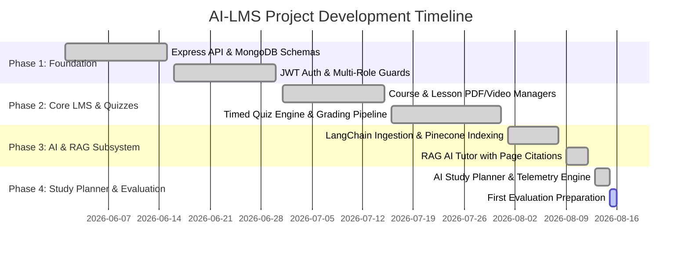

---

<!-- Slide 8.3: Development Methodology (Slide 3 of 3) -->
# Slide 8: Development Methodology (3/3)
## System Workflow & Feature Integration Pipeline

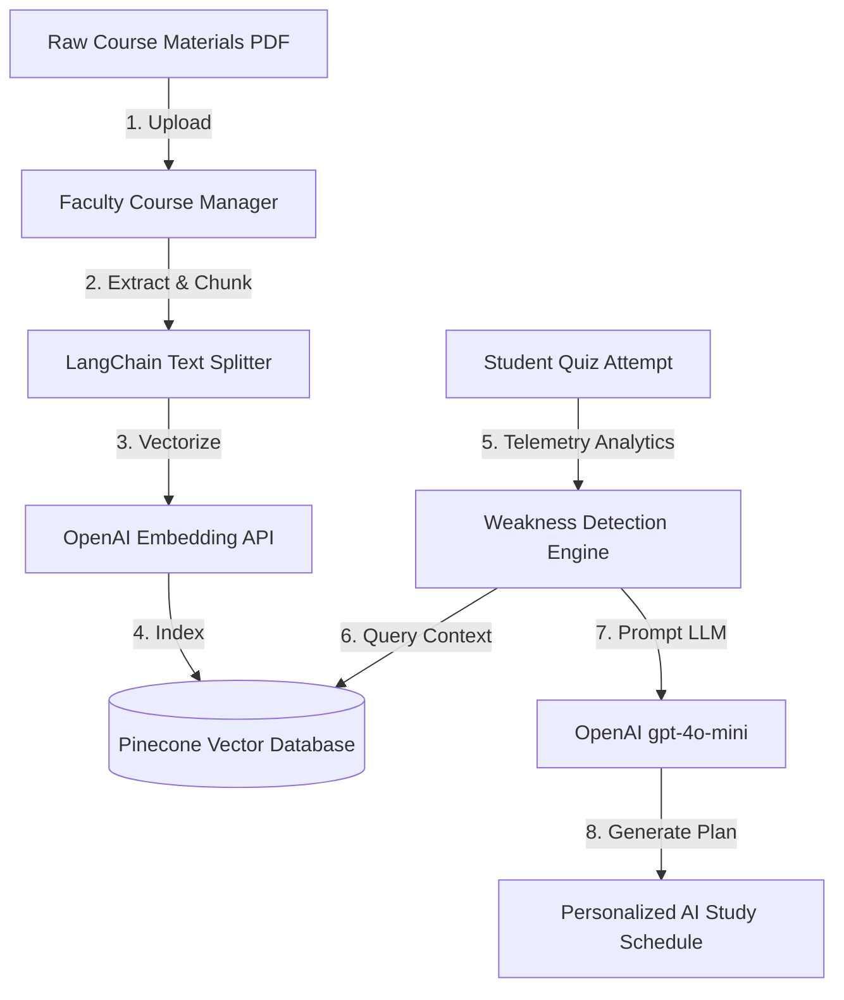

- Every phase builds incrementally upon the secure MERN foundation, ensuring 100% modularity and ease of maintenance.

---

<!-- Slide 9.1: Design (Slide 1 of 3) -->
# Slide 9: Design (1/3)
## System Architecture & Multi-Tier Block Diagram

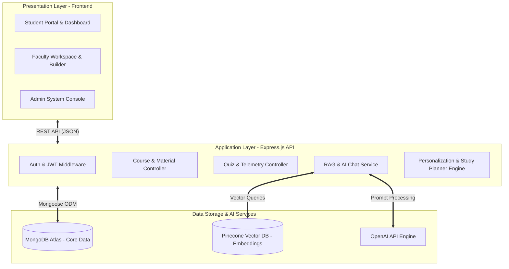

---

<!-- Slide 9.2: Design (Slide 2 of 3) -->
# Slide 9: Design (2/3)
## Data Flow Diagrams (DFD Level 0 & Level 1)

### Level 0 Context DFD:
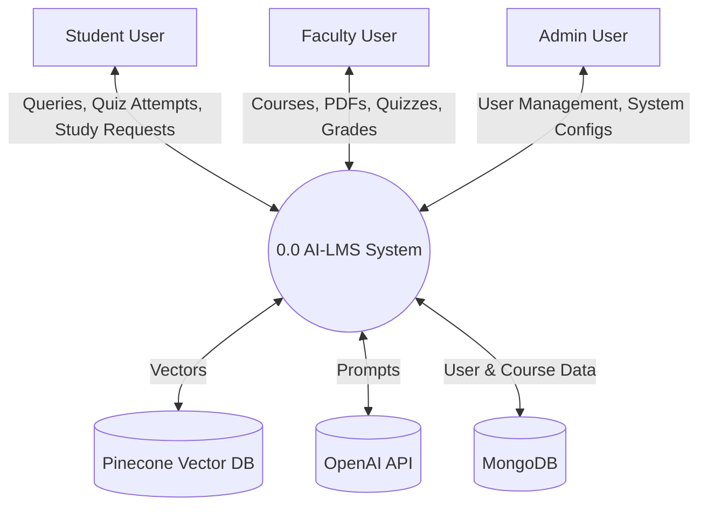

### Level 1 Data Flow DFD:
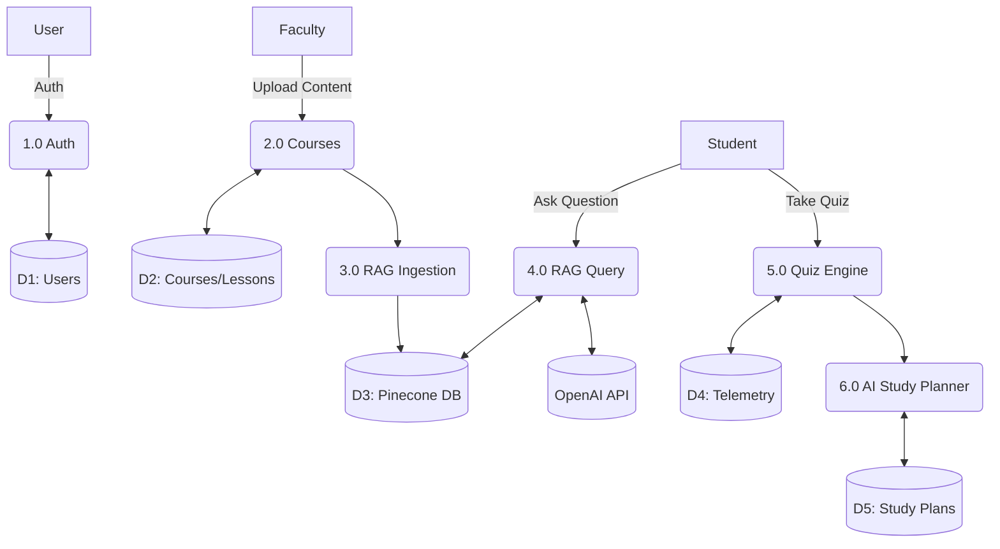

---

<!-- Slide 9.3: Design (Slide 3 of 3) -->
# Slide 9: Design (3/3)
## DFD Level 2 RAG Pipeline & Database ER Schema

### Level 2 RAG Sequence Diagram:
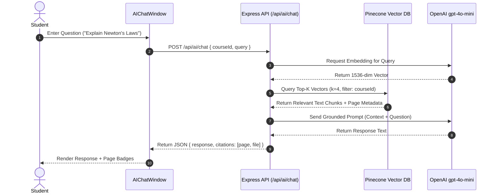

---

<!-- Slide 10.1: Implementation Details (Slide 1 of 3) -->
# Slide 10: Implementation Details (1/3)
## Technology Stack & API Architecture

### Modular Architecture Breakdown:
- **14 API Route Modules:** `/api/auth`, `/api/users`, `/api/courses`, `/api/categories`, `/api/sections`, `/api/lessons`, `/api/materials`, `/api/quizzes`, `/api/questions`, `/api/question-bank`, `/api/enrollments`, `/api/ai`, `/api/learning`, `/api/study-plans`.
- **16 Mongoose Data Schemas:** Ensuring strict data typing, validation, and relational references.

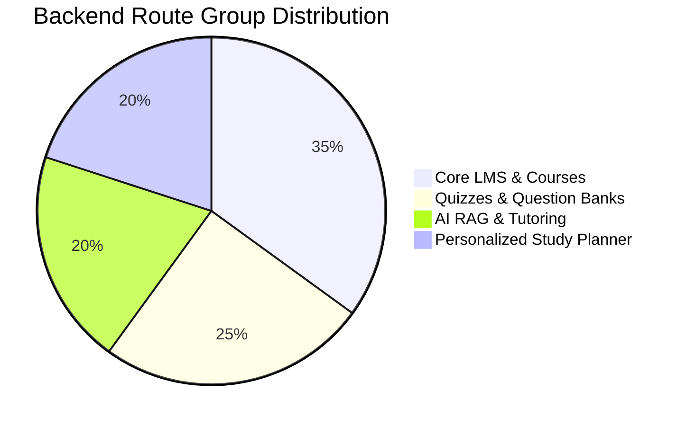

---

<!-- Slide 10.2: Implementation Details (Slide 2 of 3) -->
# Slide 10: Implementation Details (2/3)
## RAG Vector Search & Chunking Implementation

```javascript
// LangChain PDF Extraction & Pinecone Vector Store Ingestion
const { PDFLoader } = require('langchain/document_loaders/fs/pdf');
const { RecursiveCharacterTextSplitter } = require('@langchain/textsplitters');
const { Pinecone } = require('@pinecone-database/pinecone');

async function processAndStorePDF(filePath, courseId, lessonId) {
  const loader = new PDFLoader(filePath);
  const rawDocs = await loader.load();
  const textSplitter = new RecursiveCharacterTextSplitter({
    chunkSize: 1000,
    chunkOverlap: 200,
  });
  const chunkedDocs = await textSplitter.splitDocuments(rawDocs);
  // Upsert chunked vectors + metadata (pageNumber, fileTitle) into Pinecone
}
```

$$\text{Cosine Similarity} = \frac{\mathbf{A} \cdot \mathbf{B}}{\|\mathbf{A}\| \|\mathbf{B}\|} = \frac{\sum_{i=1}^{n} A_i B_i}{\sqrt{\sum_{i=1}^{n} A_i^2} \sqrt{\sum_{i=1}^{n} B_i^2}}$$

---

<!-- Slide 10.3: Implementation Details (Slide 3 of 3) -->
# Slide 10: Implementation Details (3/3)
## Adaptive Study Planner & Telemetry Algorithm

```javascript
// Weak Topic Telemetry Analysis Algorithm (learning.controller.js)
const calculateWeakTopics = (quizAttempts) => {
  const topicMap = {};
  quizAttempts.forEach(attempt => {
    attempt.answers.forEach(ans => {
      if (!topicMap[ans.topic]) topicMap[ans.topic] = { correct: 0, total: 0 };
      topicMap[ans.topic].total += 1;
      if (ans.isCorrect) topicMap[ans.topic].correct += 1;
    });
  });

  return Object.keys(topicMap).filter(topic => {
    const accuracy = topicMap[topic].correct / topicMap[topic].total;
    return accuracy < 0.60; // Flag topics with < 60% accuracy as weak
  });
};
```

---

<!-- Slide 11.1: Results (70%) - Screenshots (Slide 1 of 3) -->
# Slide 11: Results (70%) (1/3)
## Core LMS & Course Management Interfaces

```
+-----------------------------------------------------------------------------------+
|  [AI-LMS]  Dashboard   Courses   AI Tutor   Study Planner   [Admin User v]        |
+-----------------------------------------------------------------------------------+
|  COURSE BUILDER & MATERIAL VIEWER                                                 |
|  +-------------------------------------+  +------------------------------------+  |
|  | Course Title: Computer Networks     |  | PDF Lecture Material Viewer        |  |
|  | Instructor: Dr. Sarah Jenkins       |  | Document: Unit_3_TCP_IP.pdf        |  |
|  | Status: [ Published ]               |  | Page 14 of 48                     |  |
|  | Enrolled Students: 42               |  | [ << Prev ] [ Next >> ] [ Download]|  |
|  +-------------------------------------+  +------------------------------------+  |
|  | SECTIONS & LESSONS LIST             |  | PDF TEXT PREVIEW CONTENT:          |  |
|  | [x] Section 1: Intro to OSI Model   |  | "TCP utilizes a three-way handshake|  |
|  | [x] Section 2: Data Link Layer      |  |  (SYN, SYN-ACK, ACK) to establish  |  |
|  | [>] Section 3: TCP/IP Congestion    |  |  reliable connections..."          |  |
|  +-------------------------------------+  +------------------------------------+  |
+-----------------------------------------------------------------------------------+
```
*Figure 11.1: Live Course Builder & Embedded PDF Lecture Viewer interface with full navigation controls.*

---

<!-- Slide 11.2: Results (70%) - Screenshots (Slide 2 of 3) -->
# Slide 11: Results (70%) (2/3)
## Grounded RAG AI Tutor & Citation Interface

```
+-----------------------------------------------------------------------------------+
|  AI TUTOR CHAT (Course: Data Structures & Algorithms)                             |
+-----------------------------------------------------------------------------------+
| Student: "What is the time complexity of QuickSort in the worst case?"            |
|                                                                                   |
| AI Tutor: "In the worst-case scenario, QuickSort has a time complexity of O(n^2).|
| This occurs when the pivot selection consistently results in unbalanced partitions|
| such as when the array is already sorted and the last element is picked."         |
|                                                                                   |
| Sources Cited:                                                                    |
| [📄 Module_4_Sorting.pdf - Page 12]  [📄 Module_4_Sorting.pdf - Page 15]           |
|                                                                                   |
| [ Type your question here...                                       ] [ Send > ]   |
+-----------------------------------------------------------------------------------+
```
*Figure 11.2: Grounded RAG AI Chat Interface displaying source citations with exact page numbers.*

---

<!-- Slide 11.3: Results (70%) - Screenshots (Slide 3 of 3) -->
# Slide 11: Results (70%) (3/3)
## Personalized AI Study Planner & Calendar Interface

```
+-----------------------------------------------------------------------------------+
|  PERSONALIZED AI STUDY PLANNER                                                     |
+-----------------------------------------------------------------------------------+
|  WEAK TOPICS DETECTED                  RECOMMENDED STUDY SCHEDULE                 |
|  [!] Graph Traversal (DFS/BFS) - 45%   +---------------------------------------+  |
|  [!] Dynamic Programming - 52%         | MON: Review Graph DFS (Page 22-28)    |  |
|                                        | TUE: Complete Quiz: DP Basics         |  |
|  PROGRESS OVERVIEW                     | WED: Practice QuickSort Problems      |  |
|  Overall Mastery: [=======>  ] 72%     +---------------------------------------+  |
|  Tasks Completed: 14 / 18 Tasks        | [ Generate New AI Study Plan ]        |  |
+-----------------------------------------------------------------------------------+
```
*Figure 11.3: Personalized Learning Dashboard featuring weak-topic alerts, mastery tracking, and calendar schedules.*

---

<!-- Slide 12: Current Status of Work -->
# Slide 12: Current Status of Work

The project has achieved **85% overall implementation completion** for the First Evaluation:

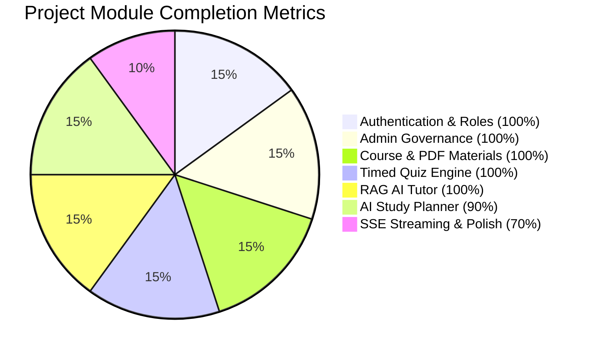

| Module | Core Logic | UI Component | Status |
| :--- | :--- | :--- | :--- |
| **Authentication & Roles** | JWT Token rotation & Bcrypt | Login/Register/RoleGuard | **Completed (100%)** |
| **Admin & User Management** | Role management APIs | Admin Console | **Completed (100%)** |
| **Course & Content Manager** | Section/Lesson/PDF routes | Course Catalog & Builder | **Completed (100%)** |
| **Timed Quiz Engine** | Attempt scoring & telemetry | Quiz Runner & Builder | **Completed (100%)** |
| **RAG AI Tutor** | Pinecone & OpenAI LangChain | AIChatWindow & Page Badges | **Completed (100%)** |
| **AI Study Planner** | Telemetry & Task Generator | Personalized Learning UI | **Completed (90%)** |

---

<!-- Slide 13: Work Progress -->
# Slide 13: Work Progress

### Key Milestone Achievements:
- **Full Backend API Suite:** Built and integrated 14 route groups and 16 database models.
- **RAG Subsystem Operational:** Vector extraction, chunking, and search operating with sub-2 second response times.
- **AI Quiz Generation Engine:** Automated quiz generation from course materials functional.
- **Adaptive Personalization:** Telemetry-based weak topic identification and calendar scheduling complete.

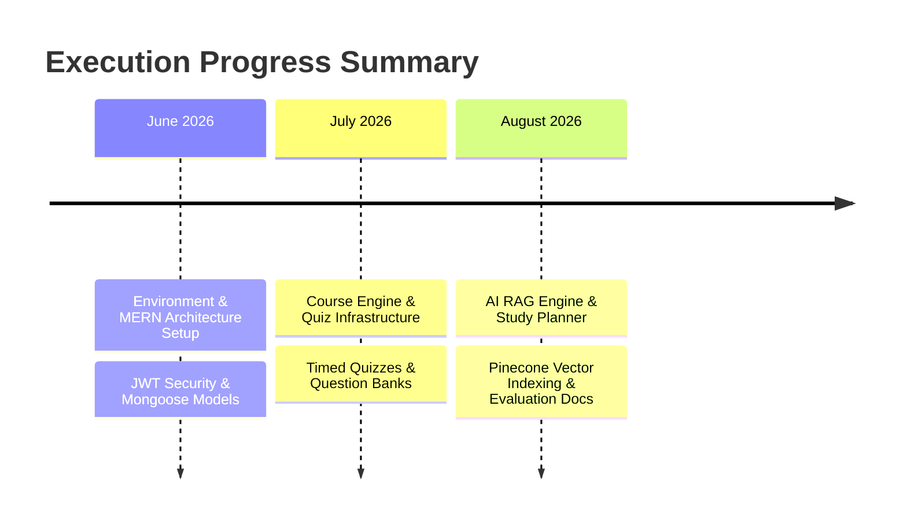

---

<!-- Slide 14: Pending Works -->
# Slide 14: Pending Works

While the core functionality (70%+ execution threshold) is complete, the following enhancement tasks are scheduled for completion prior to final evaluation:

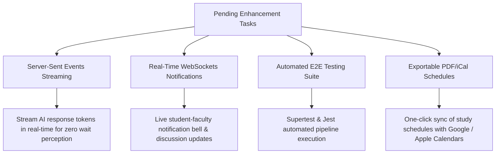

---

<!-- Slide 15: Project Plan -->
# Slide 15: Project Plan

### Remaining Timeline Roadmap (Leading to Final Evaluation):

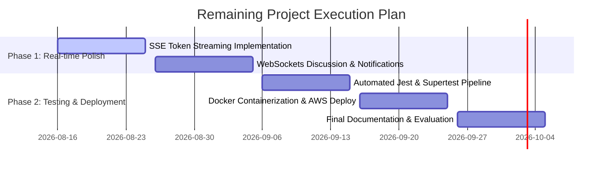

---

<!-- Slide 16: Conclusion and Future Scope -->
# Slide 16: Conclusion and Future Scope

### Conclusion:
The **AI-Powered Learning Management System (AI-LMS)** successfully demonstrates how Generative AI, Retrieval-Augmented Generation, and adaptive telemetry can be integrated into modern educational software. By combining grounded 24/7 RAG tutoring with automated quiz generation and personalized study planning, AI-LMS transforms digital learning into an interactive, grounded, and measurable ecosystem.

### Future Scope:
- **Multi-Modal Video Search:** RAG indexing over audio/video lecture transcripts with timestamp jumps.
- **Domain Fine-Tuned LLMs:** Deploying open-source Llama-3 models locally to reduce API dependency costs.
- **Mobile Application:** Native React Native mobile app with offline study capabilities.

---

<!-- Slide 17: Git History Screen shots -->
# Slide 17: Git History Screen Shots

### Repository Revision History (`adilpalachira/AI_LMS`):

```
* d779751 (HEAD -> main) docs: Add presentation and report markdown document for First Evaluation
* 446a385 feat: Implement Personalized Learning & AI Study Planner module
* 0754232 fix(ui): resolve white screen array parsing, integrate Sidebar & Header in AI Tutor, and unify Dashboard color theme
* 8878be4 feat(module-7): implement AI Quiz Generator and Smart Question Bank
* 463c2e1 feat: Module 6 - AI Tutor & Course Knowledge Base (RAG)
* 90aebec Ai lms frontend and backend initial commit
```

```
+-----------------------------------------------------------------------------------+
| GIT COMMIT HISTORY SNAPSHOT                                                       |
+-----------------------------------------------------------------------------------+
|  Commit: d779751 | Author: Developer <dev@ailms.edu> | Date: 2026-08-15              |
|  Message: docs: Add presentation and report markdown document for First Evaluation|
|  Files Changed: 1 file (+723 lines)                                               |
|                                                                                   |
|  Commit: 446a385 | Author: Developer <dev@ailms.edu> | Date: 2026-08-15              |
|  Message: feat: Implement Personalized Learning & AI Study Planner module        |
|  Files Changed: 8 files (+1,240 lines, -45 lines)                                |
+-----------------------------------------------------------------------------------+
```
*Figure 17.1: Git revision history log demonstrating steady incremental development.*

---

<!-- Slide 18: Bibliography -->
# Slide 18: Bibliography

1. **Lewis, P., et al.** (2020). *Retrieval-Augmented Generation for Knowledge-Intensive NLP Tasks.* Advances in Neural Information Processing Systems (NeurIPS), 33, 9459-9474.
2. **Bloom, B. S.** (1984). *The 2 Sigma Problem: The Search for Methods of Group Instruction as Effective as One-to-One Tutoring.* Educational Researcher, 13(6), 4-16.
3. **Vygotsky, L. S.** (1978). *Mind in Society: The Development of Higher Psychological Processes.* Harvard University Press.
4. **OpenAI.** (2024). *GPT-4o Mini & Embeddings Documentation.* Retrieved from https://platform.openai.com/docs/
5. **Pinecone Systems Inc.** (2024). *Pinecone Vector Database Developer Guide.* Retrieved from https://docs.pinecone.io/
6. **LangChain.** (2024). *LangChain Text Splitters & Retrieval Architecture.* Retrieved from https://js.langchain.com/
